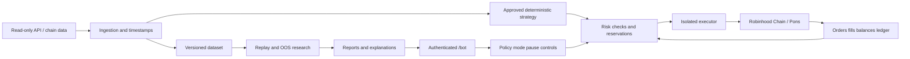

# План CryptoBot к ревью

Дата исследования: 8 октября 2026. Статус: **предложение; реализация торгового бота ещё не начата**.

## Подтверждённый выбор

Пользователь после разбора человеческого ТЗ v1.1 уточнил целевой продукт: **Robinhood Chain + Pons**. Это заменяет первоначальное предположение о Robinhood Crypto EU. Текущий scope — одна сеть, mainnet **chain ID 4663**, gas в **ETH**, только подтверждённые Pons V1/V2; без Solana, Pump и других площадок. Подтверждены бюджеты **USD 150 / 1 000 / 5 000**, входы **USD 10 / 50 / 250**; публичные кошельки пользователь пришлёт позже.

[Официальная документация сети](https://docs.robinhood.com/chain/connecting/) подтверждает chain ID, RPC/WebSocket и необходимость production-провайдера. [Репозиторий Pons](https://github.com/ponsdotdev/pons-labs) описывает V1 и V2. Это подтверждает техническое направление, но ещё не верифицирует deployed bytecode, конкретные адреса, права контрактов, ликвидность или прибыльность стратегии. Первый инженерный gate — versioned registry с проверенным on-chain доказательством для каждого маршрута.

[Обзор человеческого ТЗ](docs/research/spec-review.md) объясняет, какие идеи приняты, изменены или оставлены экспериментальными. Исходный DOCX не публикуем в публичном репозитории. [Исследование Robinhood Crypto API](docs/research/robinhood-feasibility.md) остаётся справкой о различии продуктов; ограничение US-only **не блокирует** выбранный Robinhood Chain путь.

## Что бот должен доказать

Цель — обнаружить устойчивый, **воспроизводимый нами** паттерн, а не скопировать красивый исторический P&L. Проверяем две гипотезы отдельно: задержанное следование за выбранными кошельками и самостоятельный сигнал из их поведения. Бот должен уметь не торговать. Если преимущество не подтверждается после издержек, результат этапа — **no-go для live**, а не очередной подбор параметров на тех же данных.

До получения адресов можно подготовить контракт данных, synthetic fixtures и список необходимых источников. Успешных кошельков, их доходность или готовую стратегию пока не заявляем.

## Этапы и критерии перехода

| Этап | Результат | Проверка / условие перехода |
|---|---|---|
| 0. Подготовка — этот PR | Исследование, 5 skills, воспроизводимое происхождение, план | Ревью пользователем; решение о следующем этапе. Нет live keys, сделок и deployment |
| 1. Feasibility + данные | Реестр Pons V1/V2, ABI/bytecode/routes, production RPC/история, read-only ingestion; публичные кошельки с network ID | Подтверждены registry, токены quote, события и переходы стадий; измерены полнота, задержка, rate limits, права данных и ежемесячная стоимость; неизвестный маршрут — no-go |
| 2. Исследование edge | Версионированные датасеты, feature pipeline, журнал гипотез, causal replay | Учтены комиссии/спред/ликвидность/FX; воспроизводится выбор кошельков на историческую дату; нет look-ahead |
| 3. Walk-forward и holdout | Отчёт отдельно для трёх размеров, сравнение с no-trade и простыми baselines | Замороженная стратегия прошла следующие временные окна, final holdout и стресс расходов/задержек; неопределённость и концентрация приемлемы |
| 4. Paper + operations | Paper execution на живых котировках, кабинет, reconciliation, alerts, kill switch | Предварительный ориентир ≥30 календарных дней и ≥100 завершённых сделок **не является статистической гарантией**; для редкой/коррелированной стратегии тест дольше. Нет необъяснённых расхождений, пройдены аварийные сценарии |
| 5. Ограниченный live pilot | Отдельно утверждённые площадка, капитал, максимальные потери и bounded policy | Только после явного решения пользователя и прохождения gates. Сравнение фактических fills с paper, корректная остановка и восстановление |
| 6. Масштабирование | Отдельное решение для USD 1 000 и 5 000 | Повторная проверка capacity, drawdown, ликвидности и реальных расходов. Успех малого размера не доказывает применимость большого |

Этапы 1–4 могут завершиться без live. Историческое исследование возможно только при доступной пригодной истории; иначе сначала накапливаем её вперёд. Не заменяем отсутствующие point-in-time данные сегодняшними leaderboard/tag значениями.

## Метод исследования

- Фиксируем cohort кошельков в момент T, включая исключения и причины; следующий интервал оцениваем без будущих рейтингов. Учитываем исчезнувшие кошельки/токены, внешние переводы, airdrops, незакрытые позиции, связанный контроль и неизвестную себестоимость.
- Храним `event_time`, `first_seen_at`, `decision_at`, `submit_at`, `fill_at`, commitment/finality и источник. Копирующая стратегия не получает цену исходного трейдера или данные, появившиеся позже. Измеряем p50/p95/p99 задержки.
- Проверяем реальные размеры, вход **и выход**, частичные исполнения, отказы, проскальзывание, priority fees/tips при DEX и доступность sell. Отсутствие sell route или цены не превращаем в нулевой убыток.
- Time-ordered walk-forward, purging/embargo для пересекающихся горизонтов, untouched holdout, реестр всех испробованных стратегий. Доверительные интервалы рассчитываем с учётом кластеров токен/кошелёк/временной режим; число сделок не равно числу независимых наблюдений.
- Отчёт включает net expectancy, equity/drawdown, tail loss, turnover, fill/reject rate, концентрацию P&L, устойчивость по режимам и отклонение actual/paper. Предлагаемый live gate: нижняя граница заранее выбранного 95% интервала trading net expectancy >0 на OOS, положительный economic net после инфраструктуры отдельно для каждого preset и положительный результат при удвоении измеренных переменных издержек; это консервативное проектное правило, не доказательство будущей прибыли.
- Сначала прозрачные правила и baseline. ML допускается после достаточных данных и сравнения с baseline; LLM помогает анализировать и объяснять, но не определяет разрешение на перевод средств.

Методика и первичные источники: [wallet edge validation](docs/research/wallet-edge-validation.md).

## Бюджеты, расходы и предварительные лимиты

Запрошенные входы — **notional**, не максимальный возможный убыток. USD — единица отчётности, ETH и фактические quote assets — единицы исполнения. Stablecoin не приравнивается к USD без оценки; храним decimals, источник курса, время и расходы конверсии. Резерв ETH на выходы и неудачные транзакции отделяем от торгового капитала. Капитал стратегии и расходы на инфраструктуру учитываются раздельно.

| Капитал | Желаемый вход | Доля капитала | Предлагаемый риск на плановую сделку: ≤0,5% | Суточная остановка: 2% | Drawdown pause: 8% |
|---|---:|---:|---:|---:|---:|
| USD 150 | USD 10 | 6,67% | USD 0,75 | USD 3 | USD 12 |
| USD 1 000 | USD 50 | 5% | USD 5 | USD 20 | USD 80 |
| USD 5 000 | USD 250 | 5% | USD 25 | USD 100 | USD 400 |

Это **предложенные параметры для проверки и отдельного утверждения**, не уже разрешённая live-policy. Плановый stop-loss не гарантирует исполнение; rug/gap может потерять весь notional и больше планового риска с учётом fees. Для высокорискового токена без надёжного выхода риск моделируем как полную стоимость позиции. При лимите 0,5% такие входы $10/$50/$250 не проходят — позиция уменьшается или сигнал пропускается; лимит не расширяется автоматически. Любое принятие большего tail risk выносится на отдельное решение.

Необязательный начальный вариант для обсуждения при калибровке: ≤3 одновременных позиций, gross exposure ≤20% equity, один asset/коррелированный кластер ≤10%; все pending orders резервируют средства. Более строгие per-trade, liquidity и risk caps имеют приоритет. Суточные потери включают realized/unrealized P&L и расходы, скорректированные на deposits/withdrawals; drawdown считается от cash-flow-adjusted (unitized) equity high-water mark, чтобы депозит не скрывал просадку и вывод не создавал ложный убыток. Новые входы блокируются сразу, выходы выполняются по заранее утверждённой политике. Эти пороги могут пересматриваться по исследованию, но никогда самовольно повышаться после убытков.

Стоимость отчёта разделяем:

1. **Trading net P&L**: фактическая разница buy/sell fills минус ещё не включённые fees, failed-transaction costs и FX. Spread/impact уже в исполнимых ценах не вычитаем повторно.
2. **Economic net P&L**: trading net P&L минус API/RPC/история/hosting/monitoring. Даже прибыльные сделки могут не окупить сервис при банке $150.
3. **Иллюстрация, не тариф**: фиксированные $0,20 за круг составят 2% от $10, 0,4% от $50 и 0,08% от $250 ещё до других издержек. Поэтому конкретный preset может получить no-go независимо от остальных.

## Предлагаемая архитектура

Стартуем с модульного приложения и отдельного процесса executor, без преждевременного множества сервисов. Rust для intake/executor из ТЗ рассматриваем после замера latency и нагрузки; он не считается автоматически необходимым до прототипа. Предварительный стек: Python для ingestion/research/risk/API, PostgreSQL для состояния и audit ledger, Parquet/object storage для больших immutable datasets, TypeScript UI. Версии и UI framework закрепим после осмотра существующего aistat-приложения; совместимость хоста важнее предпочтения нового стека.

Skills живут только в среде разработки. LLM не получает signing keys и не находится в цепочке выдачи trade permission. Live-policy — versioned artifact с разрешёнными активами/площадкой, лимитами, mode, expiry и audit trail. Разрешённая автономность означает исполнение **внутри этой политики**, а не самостоятельную смену стратегии и лимитов агентом.

Durable order intent + client ID записываются до запроса; timeout означает unknown, затем reconciliation, а не слепой повтор. Частичный fill, cancel-in-flight, restart, duplicate events, reorg/expiry для chain учитываются state machine. На старте и периодически сверяем баланс/позиции/open orders с площадкой; неизвестный остаток блокирует входы. Kill switch разделяет pause entries, cancel и controlled exit: экстренная ликвидация тоже может не исполниться.

Ключи хранятся вне репозитория, UI и CI, в secret store/изолированном signer; по возможности без withdrawal scope. Вход в кабинет через существующую auth, роли viewer/operator, MFA для оператора и повторная авторизация для live/policy changes, CSRF/session/rate-limit controls. Приватный EVM-ключ технически может подписать произвольную транзакцию, поэтому signer применяет allowlist chain/contracts/selectors, caps value/allowance/gas и сверку calldata с intent, а кошелёк имеет ограниченный баланс. Минимальные approvals, контроль spender и отдельный резерв ETH обязательны. Проверяем состав транзакции, получателей и суммы до подписи; симуляция не доказывает будущую продаваемость.

Основа проектных security controls: [OWASP Authentication](https://cheatsheetseries.owasp.org/cheatsheets/Authentication_Cheat_Sheet.html), [Secrets Management](https://cheatsheetseries.owasp.org/cheatsheets/Secrets_Management_Cheat_Sheet.html), [Transaction Authorization](https://cheatsheetseries.owasp.org/cheatsheets/Transaction_Authorization_Cheat_Sheet.html). Полноценный threat model появится после подтверждения компонентов и размещения; текущая схема — предложение, а не свидетельство реализованной защиты.

## Что переносим из человеческого ТЗ

- **Pons registry и отдельные route adapters.** V1, V2 curve и V2 graduated pool имеют разные события, комиссии, quote assets и цены. Graduation не равна готовности пула: отслеживаем отдельные стадии и подтверждаем pool creation/liquidity. Реестр хранит chain/address, deployment evidence, block/hash, bytecode hash, ABI/source commit, proxy implementation при наличии и разрешённые selectors. Неожиданное изменение блокирует новые входы.
- **Canonical event store.** Immutable raw events содержат chain/block/tx/log references, source/decoder version и first-seen time. Reorg сохраняет исходную запись, помечает её orphaned, откатывает производные агрегаты и пересчитывает состояние. Sequencer observation не равна finality; предфинальные сигналы — отдельный эксперимент с бюджетом риска, а не default live.
- **Надёжный EVM executor.** Durable intent и nonce owner на кошелёк; состояния not-sent, pending, included, confirmed, reverted, replaced, unknown. Replacement использует управляемую nonce policy; reorg не допускает двойного входа. Резерв ETH покрывает exits и серию failed transactions. При stale feed новые входы запрещены; защитный выход требует независимой свежей котировки и утверждённых slippage/gas caps либо остановки с сигналом оператору. Нельзя продавать вслепую из-за отказа social API.
- **Safety/Cost/Risk gates и разбор отказов.** Сохраняем score/features, причины, quality flags и версии правил. Cost Gate использует оценённое на OOS распределение результата и неопределённость расходов; score 78 или желаемые +60% не превращаются в ожидаемую прибыль. Organic flow и wallet clusters оцениваем с неопределённостью, social matching — по точному contract address. Обязательный social-фильтр из ТЗ сохраняем в исходном исследовательском варианте; изменение политики требует явного решения. Его полезность и веса 25/20/15/15/15/10 проверяем через ablation; недоступный сигнал не считается благоприятным.
- **Экономика каждого выхода.** Частичные exits оплачиваются отдельно, small notional может поддерживать только один выход. Доли задаём однозначно: от исходной позиции или текущего остатка. Фиксированные +60%/x2/x3, runner и trailing — альтернативные гипотезы, которые сравниваем на net OOS; не складываем их в одновременно действующую стратегию.
- **Неизменяемые snapshots и предложения.** Сохраняем снимки регулярно, но LLM-анализ каждые 3 часа не обязателен без оценки стоимости и достаточных новых данных. Предложения версионируются и проходят новое OOS/paper; параметры не меняются автоматически. Запрет автоматического изменения стратегии не отменяет автоматическую остановку, сверку сети и operational recovery по утверждённой политике.

Цель десятикратного роста и старые paper-банки $10/$20/$50/$100 из ТЗ не становятся критериями приёмки: актуальные бюджеты заданы пользователем, а допуск определяется воспроизводимостью, net edge и риском.

## GitHub, проверки и aistat.app/bot

`FomaBy/CryptoBot` — публичный репозиторий. Initial baseline содержит только README и ignore; исследование проходит отдельным PR. Все последующие изменения — reviewable commits, CI без торговых секретов, dependencies/actions pinned, secret scanning, lint/types, unit и adapter contract tests, integration/replay tests; перед live — failure injection и recovery drills. Подготовительный CI сейчас проверяет целостность skills, ссылки и отсутствие запрещённых tracked credential paths.

Read-only проверка существующего `https://aistat.app/` и `/bot` вернула перенаправление на login. Это существующий защищённый сайт: ответ не доказывает, что `/bot` свободен. До deployment инвентаризируем приложение, hosting/proxy, base path, cookies/CSRF, OAuth callbacks, базу и backup/restore; интегрируем auth, а не создаём второй независимый вход. Затем staging под `/bot`, проверка routing/deep links/assets и изоляции trading worker, rollback, и только после утверждённого deployment — публикация. DNS и production в этой фазе не меняем.

## Короткий порядок работы на ревью

1. Утвердить этот план для Robinhood Chain + Pons; проверить реальные контракты, версии, маршруты и источники данных.
2. Поднять воспроизводимый сбор публичных данных и расходов; кошельки добавить, когда пользователь пришлёт адреса.
3. Найти несколько объяснимых гипотез, отсеять некопируемые и проверить их причинным replay.
4. Пройти walk-forward/holdout и экономику отдельно для трёх бюджетов; при отсутствии edge остановить live-направление.
5. Собрать paper-бот и защищённый кабинет `/bot`, проверить аварии и сверку состояния.
6. Только отдельным решением включить ограниченный live pilot; повышать капитал по измеренным результатам.
