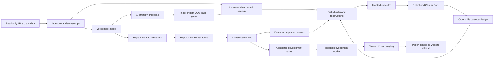

# План разработки CryptoBot

Обновлено 9 октября 2026. **Первый web-инкремент опубликован на `aistat.app/bot`; multiuser с отдельными аккаунтами/кошельками.** Backend и UI проверены локально; public production smoke пройден. Авторизованный production E2E требует действующей сессии пользователя. Это не live mandate: средства, торговая подпись и реальные сделки не подключаются.

Новые требования пользователя включены в [реестр R-ID](REQUIREMENTS.md): кабинет/кошелёк, антискам-проверки, AI-улучшение стратегий и исполняемый AI backlog сайта. Порядок и критерии реализации — в [backlog](docs/backlog.md), фактически сделанное — в [журнале](docs/execution-log.md). Позднее пожелание AI-улучшений заменяет старое требование ручного подтверждения каждой новой стратегии: внутри заранее утверждённой области возможен автоматический допуск через независимые проверки. Фоновые workers ещё не реализованы и не запущены; месячный бюджет AI/данных остаётся открытым. Разрешение текущего deployment не включает бесконечную платную автоматизацию.

## Подтверждённый выбор

Опубликован общий источник анализов с AI-Crypto-Statistics: `/crypto` сохраняет статистику, `/bot` — кабинет и будущий исполнитель. ACS остаётся единственным производителем существующих оценок; бот получает versioned public projection без private wallet feed и owner cookies. На обеих страницах сопоставимы token/analysis/snapshot IDs, source revision и времена исходных наблюдений. Pons label — только reported scope, registry и sellability остаются непроверенными; оценка ACS не включает live permission. Контракт описан в [общей аналитике](docs/shared-analysis.md).

Опубликованное дополнение по запросу пользователя — [исторический прогон текущего ACS-профиля](docs/historical-backtest.md), R-025/B-023. Он использует существующие записи, фиксирует последнее 14-дневное UTC окно и предлагает неполный доступный период только отдельным выбором. Сценарное численное исследование не заменяет полный causal edge/OOS этап, поскольку архив не содержит всех live guards и исполнимых quotes.

Пользователь после разбора человеческого ТЗ v1.1 уточнил целевой продукт: **Robinhood Chain + Pons**. Это заменяет первоначальное предположение о Robinhood Crypto EU. Текущий scope — одна сеть, mainnet **chain ID 4663**, gas в **ETH**, только подтверждённые Pons V1/V2; без Solana, Pump и других площадок. Подтверждены бюджеты **USD 150 / 1 000 / 5 000**, входы **USD 10 / 50 / 250**. Список кошельков получен и локально проверен; адреса и labels хранятся только в исключённом из Git `data/wallet-intake/`.

[Официальная документация сети](https://docs.robinhood.com/chain/connecting/) подтверждает chain ID, RPC/WebSocket и необходимость production-провайдера. [Репозиторий Pons](https://github.com/ponsdotdev/pons-labs) описывает V1 и V2. Это подтверждает техническое направление, но ещё не верифицирует deployed bytecode, конкретные адреса, права контрактов, ликвидность или прибыльность стратегии. Первый инженерный gate — versioned registry с проверенным on-chain доказательством для каждого маршрута.

[Обзор человеческого ТЗ](docs/research/spec-review.md) объясняет, какие идеи приняты, изменены или оставлены экспериментальными. Исходный DOCX не публикуем в публичном репозитории. [Исследование Robinhood Crypto API](docs/research/robinhood-feasibility.md) остаётся справкой о различии продуктов; ограничение US-only **не блокирует** выбранный Robinhood Chain путь.

## Что уже реализовано и что ещё предстоит

В `server/{auth,store,wallets,app,index}.js` готовы root-session adapter, account-scoped SQLite, EOA ownership challenge/verify/unlink, приватные задачи, USD preset и базовый audit. Защищённые API проверяют сессию, изменяющие запросы — Origin/CSRF; owner/status injection отклоняются. Первый web release опубликован, исходные 16 тестов и UI/public production QA пройдены; текущие проверки расширены для общей аналитики. Статусы R-005/R-006/R-018 остаются PARTIAL до полной приёмки.

Опубликованы shared ACS analysis и исторические сценарии с сохранением аккаунтных отчётов (E-017–020). Последние проверки исторического инкремента: 25 тестов bot, production health/assets/auth denial и фактические расчёты. Анализ 214 кандидатов, полноценный causal execution replay, paper trading, development worker и signer ещё не реализованы. Ограниченное исследование 48 вариантов R-026/B-024 опубликовано и выполнено по заранее зафиксированному envelope: положительные base ячейки не прошли stress/сэмпл gate, выбран no-trade; это не работающий автономный optimizer и не доказательство edge. Подробности и ограничения — [execution log](docs/execution-log.md).

## Что бот должен доказать

Цель — обнаружить устойчивый, **воспроизводимый нами** паттерн, а не скопировать красивый исторический P&L. Проверяем две гипотезы отдельно: задержанное следование за выбранными кошельками и самостоятельный сигнал из их поведения. Бот должен уметь не торговать. Если преимущество не подтверждается после издержек, результат этапа — **no-go для live**, а не очередной подбор параметров на тех же данных.

Локальный intake сохраняет точную копию источника, SHA-256, время чтения, нормализованный manifest и отчёт валидации. В исходнике нет поля сети: chain ID 4663 задан контекстом проекта, активность в этой сети и участие в Pons ещё не проверены. Labels остаются пользовательскими гипотезами. Реализация теперь одобрена отдельным решением пользователя; сам импорт не даёт торговых полномочий. Успешность кошельков и готовую стратегию пока не заявляем.

## Этапы и критерии перехода

| Этап | Результат | Проверка / условие перехода |
|---|---|---|
| 0. Подготовка — выполнена | Исследование, 5 skills, требования и backlog | Пользователь разрешил разработку и deployment; live остаётся отдельным решением |
| 0a. Multiuser кабинет — первый web release опубликован | Root login reuse, SQLite account isolation, EOA proof, настройки и приватные задачи | Локальные auth/UI проверки и public production smoke пройдены; положительный production login/user-flow ещё требует действующей сессии |
| 1. Feasibility + данные | Реестр Pons V1/V2, ABI/bytecode/routes, production RPC/история, read-only ingestion; публичные кошельки с network ID | Подтверждены registry, токены quote, события и переходы стадий; измерены полнота, задержка, rate limits, права данных и ежемесячная стоимость; неизвестный маршрут — no-go |
| 2. Исследование edge | Версионированные датасеты, feature pipeline, журнал гипотез, causal replay | Учтены комиссии/спред/ликвидность/FX; воспроизводится выбор кошельков на историческую дату; нет look-ahead |
| 3. Walk-forward и holdout | Отчёт отдельно для трёх размеров, сравнение с no-trade и простыми baselines | Замороженная стратегия прошла следующие временные окна, final holdout и стресс расходов/задержек; неопределённость и концентрация приемлемы |
| 4. Paper + operations | Paper execution на живых котировках, кабинет, reconciliation, alerts, kill switch | Предварительный ориентир ≥30 календарных дней и ≥100 завершённых сделок **не является статистической гарантией**; для редкой/коррелированной стратегии тест дольше. Нет необъяснённых расхождений, пройдены аварийные сценарии |
| 5. Ограниченный live pilot | Отдельно утверждённые площадка, капитал, максимальные потери и bounded policy | Только после явного решения пользователя и прохождения gates. Сравнение фактических fills с paper, корректная остановка и восстановление |
| 6. Масштабирование | Отдельное решение для USD 1 000 и 5 000 | Повторная проверка capacity, drawdown, ликвидности и реальных расходов. Успех малого размера не доказывает применимость большого |

Этапы 1–4 могут завершиться без live. Историческое исследование возможно только при доступной пригодной истории; иначе сначала накапливаем её вперёд. Не заменяем отсутствующие point-in-time данные сегодняшними leaderboard/tag значениями.

## Метод исследования

- Фиксируем cohort кошельков в момент T, включая исключения и причины; следующий интервал оцениваем без будущих рейтингов. Учитываем исчезнувшие кошельки/токены, внешние переводы, airdrops, незакрытые позиции, связанный контроль и неизвестную себестоимость.
- Все 214 адресов — watchlist кандидатов. Разделяем vendor P&L, реконструированный wallet P&L и достижимый результат нашей копии. Issuer allocation, creator-tax/LP income, внешний funding и рост ETH отдельно от swap edge; cost basis unknown не превращается в нулевую себестоимость. Неликвидные/rugged позиции не удаляем из отчёта, «цена × баланс» не заменяет доступные sell proceeds. Положительная simulation и прежние продажи не доказывают будущую безопасность.
- Храним `event_time`, `first_seen_at`, `decision_at`, `submit_at`, `fill_at`, commitment/finality и источник. Копирующая стратегия не получает цену исходного трейдера или данные, появившиеся позже. Измеряем p50/p95/p99 задержки.
- Проверяем реальные размеры, вход **и выход**, частичные исполнения, отказы, проскальзывание, priority fees/tips при DEX и доступность sell. Отсутствие sell route или цены не превращаем в нулевой убыток.
- Time-ordered walk-forward, purging/embargo для пересекающихся горизонтов, untouched holdout, реестр всех испробованных стратегий. Доверительные интервалы рассчитываем с учётом кластеров токен/кошелёк/временной режим; число сделок не равно числу независимых наблюдений.
- Отчёт включает net expectancy, equity/drawdown, tail loss, turnover, fill/reject rate, концентрацию P&L, устойчивость по режимам и отклонение actual/paper. Предлагаемый live gate: нижняя граница заранее выбранного 95% интервала trading net expectancy >0 на OOS, положительный economic net после инфраструктуры отдельно для каждого preset и положительный результат при удвоении измеренных переменных издержек; это консервативное проектное правило, не доказательство будущей прибыли.
- Сначала прозрачные правила и baseline. ML допускается после достаточных данных и сравнения с baseline; LLM помогает анализировать и объяснять, но не определяет разрешение на перевод средств.

Методика и первичные источники: [wallet edge validation](docs/research/wallet-edge-validation.md).

## Бюджеты, расходы и предварительные лимиты

Запрошенные входы — **notional**, не максимальный возможный убыток. USD — единица отчётности, ETH и фактические quote assets — единицы исполнения. Stablecoin не приравнивается к USD без оценки; храним decimals, источник курса, время и расходы конверсии. Резерв ETH на выходы и неудачные транзакции отделяем от торгового капитала. Капитал стратегии и расходы на инфраструктуру учитываются раздельно.

| Капитал | Желаемый вход | Доля капитала | Предлагаемый риск на плановую сделку: ≤0,5% | Суточная остановка: 2% | Drawdown pause: 8% |
|---|---:|---:|---:|---:|---:|
| USD 150 | USD 10 | 6,67% | USD 0,75 | USD 3 | USD 12 |
| USD 1 000 | USD 50 | 5% | USD 5 | USD 20 | USD 80 |
| USD 5 000 | USD 250 | 5% | USD 25 | USD 100 | USD 400 |

Это **предложенные параметры для проверки и отдельного утверждения**, не уже разрешённая live-policy. Плановый stop-loss не гарантирует исполнение; rug/gap может потерять весь notional и больше планового риска с учётом fees. Для высокорискового токена без надёжного выхода риск моделируем как полную стоимость позиции. При лимите 0,5% такие входы $10/$50/$250 не проходят — позиция уменьшается или сигнал пропускается; лимит не расширяется автоматически. Любое принятие большего tail risk выносится на отдельное решение.

Необязательный начальный вариант для обсуждения при калибровке: ≤3 одновременных позиций, gross exposure ≤20% equity, один asset/коррелированный кластер ≤10%; все pending orders резервируют средства. Более строгие per-trade, liquidity и risk caps имеют приоритет. Суточные потери включают realized/unrealized P&L и расходы, скорректированные на deposits/withdrawals; drawdown считается от cash-flow-adjusted (unitized) equity high-water mark, чтобы депозит не скрывал просадку и вывод не создавал ложный убыток. Новые входы блокируются сразу, выходы выполняются по заранее утверждённой политике. Эти пороги могут пересматриваться по исследованию, но никогда самовольно повышаться после убытков.

Стоимость отчёта разделяем:

1. **Trading net P&L**: фактическая разница buy/sell fills минус ещё не включённые fees, failed-transaction costs и FX. Spread/impact уже в исполнимых ценах не вычитаем повторно.
2. **Economic net P&L**: trading net P&L минус API/RPC/история/hosting/monitoring. Даже прибыльные сделки могут не окупить сервис при банке $150.
3. **Иллюстрация, не тариф**: фиксированные $0,20 за круг составят 2% от $10, 0,4% от $50 и 0,08% от $250 ещё до других издержек. Поэтому конкретный preset может получить no-go независимо от остальных.

## Предлагаемая архитектура

Стартуем с модульного приложения и отдельного процесса executor, без преждевременного множества сервисов. Rust для intake/executor из ТЗ рассматриваем после замера latency и нагрузки; он не считается автоматически необходимым до прототипа. Первый web backend реализован на Node 24 с native HTTP и SQLite, изоляцией по аккаунтам; криптография EOA — ethers 6.17.0. Эти компоненты соответствуют проверенному cPanel/Node окружению. Исследовательские Python-компоненты, PostgreSQL или Parquet/object storage для будущего объёма — варианты последующих этапов, а не уже установленные сервисы. Решение по постоянно работающим intake/optimizer/executor зависит от условий хостинга и измерений.

Skills живут только в среде разработки. LLM не получает signing keys и не находится в цепочке выдачи trade permission. Live-policy — versioned artifact с разрешёнными активами/площадкой, лимитами, mode, expiry и audit trail. Разрешённая автономность включает исполнение и автоматическое продвижение проверенной стратегии **внутри утверждённого envelope**; signer/risk/evaluator полномочия при этом не расширяются.

Durable order intent + client ID записываются до запроса; timeout означает unknown, затем reconciliation, а не слепой повтор. Частичный fill, cancel-in-flight, restart, duplicate events, reorg/expiry для chain учитываются state machine. На старте и периодически сверяем баланс/позиции/open orders с площадкой; неизвестный остаток блокирует входы. Kill switch разделяет pause entries, cancel и controlled exit: экстренная ликвидация тоже может не исполниться.

Ключи хранятся вне репозитория, UI и CI, в secret store/изолированном signer; по возможности без withdrawal scope. Вход в кабинет использует существующую root auth: сервер проверяет opaque cookie через фиксированный `/api/session` и берёт `user_id`. CSRF/Origin и rate limits реализованы в первом backend. Роли viewer/operator, MFA для оператора и повторная авторизация live/policy changes остаются требованиями следующих этапов; shared `username` не выдаёт operator rights. Приватный EVM-ключ технически может подписать произвольную транзакцию, поэтому signer применяет allowlist chain/contracts/selectors, caps value/allowance/gas и сверку calldata с intent, а кошелёк имеет ограниченный баланс. Минимальные approvals, контроль spender и отдельный резерв ETH обязательны. Проверяем состав транзакции, получателей и суммы до подписи; симуляция не доказывает будущую продаваемость.

Основа проектных security controls: [OWASP Authentication](https://cheatsheetseries.owasp.org/cheatsheets/Authentication_Cheat_Sheet.html), [Secrets Management](https://cheatsheetseries.owasp.org/cheatsheets/Secrets_Management_Cheat_Sheet.html), [Transaction Authorization](https://cheatsheetseries.owasp.org/cheatsheets/Transaction_Authorization_Cheat_Sheet.html). Полноценный threat model появится после подтверждения компонентов и размещения; текущая схема — предложение, а не свидетельство реализованной защиты.

## Что переносим из человеческого ТЗ

- **Pons registry и отдельные route adapters.** V1, V2 curve и V2 graduated pool имеют разные события, комиссии, quote assets и цены. Graduation не равна готовности пула: отслеживаем отдельные стадии и подтверждаем pool creation/liquidity. Реестр хранит chain/address, deployment evidence, block/hash, bytecode hash, ABI/source commit, proxy implementation при наличии и разрешённые selectors. Неожиданное изменение блокирует новые входы.
- **Canonical event store.** Immutable raw events содержат chain/block/tx/log references, source/decoder version и first-seen time. Reorg сохраняет исходную запись, помечает её orphaned, откатывает производные агрегаты и пересчитывает состояние. Sequencer observation не равна finality; предфинальные сигналы — отдельный эксперимент с бюджетом риска, а не default live.
- **Надёжный EVM executor.** Durable intent и nonce owner на кошелёк; состояния not-sent, pending, included, confirmed, reverted, replaced, unknown. Replacement использует управляемую nonce policy; reorg не допускает двойного входа. Резерв ETH покрывает exits и серию failed transactions. При stale feed новые входы запрещены; защитный выход требует независимой свежей котировки и утверждённых slippage/gas caps либо остановки с сигналом оператору. Нельзя продавать вслепую из-за отказа social API.
- **Safety/Cost/Risk gates и разбор отказов.** Сохраняем score/features, причины, quality flags и версии правил. Cost Gate использует оценённое на OOS распределение результата и неопределённость расходов; score 78 или желаемые +60% не превращаются в ожидаемую прибыль. Organic flow и wallet clusters оцениваем с неопределённостью, social matching — по точному contract address. Обязательный social-фильтр из ТЗ — начальный вариант; AI может менять его только если это явно входит в разрешённый search space и новая версия проходит gates. Полезность и веса проверяем через ablation; недоступный обязательный сигнал не считается благоприятным.
- **Экономика каждого выхода.** Частичные exits оплачиваются отдельно, small notional может поддерживать только один выход. Доли задаём однозначно: от исходной позиции или текущего остатка. Фиксированные +60%/x2/x3, runner и trailing — альтернативные гипотезы, которые сравниваем на net OOS; не складываем их в одновременно действующую стратегию.
- **Неизменяемые snapshots и улучшения.** Сохраняем снимки регулярно; период анализа определяется новыми данными и budget. AI версионирует и preregisters гипотезы; независимый promotion controller допускает улучшение внутри envelope после новых OOS/stress/paper. Испробованные holdouts отмечаются использованными, все неудачные trials сохраняются. Risk counters, позиции и журнал переживают promotion/rollback. Автоматический pause и возврат ранее допущенной совместимой версии входят в recovery-policy.

Цель десятикратного роста и старые paper-банки $10/$20/$50/$100 из ТЗ не становятся критериями приёмки: актуальные бюджеты заданы пользователем, а допуск определяется воспроизводимостью, net edge и риском.

## Кабинет и подключение кошелька

Пользователь входит через существующий aistat login, связывает кошелёк с аккаунтом доказательством контроля и отдельно видит торговый мандат. 214 импортированных адресов — watchlist, они не становятся execution wallets. Ownership challenge привязан к account/session, domain/URI/chain, nonce и expiry; повторное применение запрещено сервером. Все ledger/jobs/API/exports и signer запросы проверяют владельца. Multiuser подтверждён для первого релиза; server-derived account state изолирован. Регистрация и login остаются в существующем root-приложении, дополнительные пользователи не получают полномочий менять общий production.

Connect/SIWE не позволяют боту торговать без пользователя. Внешний кошелёк требует подписи каждой сделки, пока не выбран и не проверен отдельный механизм: ограниченные session permissions либо изолированный bot wallet с заданным балансом и signer policy. Seed/основной приватный ключ не запрашиваем. Первый backend поддерживает только доказательство контроля EOA; contract wallets отклоняются, spendingPermission остаётся false. Поддержка автономного делегирования на Chain/Pons ещё проверяется. Disconnect, logout, pause и revoke различаются; отзыв может требовать on-chain tx и не отменяет уже broadcast транзакции. Скрытого права продать позиции после полного отзыва не сохраняем. Подробные acceptance — R-005–008.

## Два контура AI-автономии

**Market optimizer** улучшает wallet analysis, entry/exit и композиции стратегий внутри утверждённого search space. Он регистрирует гипотезу до испытания; независимый controller сравнивает её с текущей стратегией и baselines, проверяет future OOS, stress, paper, риск и economic net каждого preset. Просмотренный holdout помечается использованным; trials не исчезают. Прошедшая версия автоматически продвигается в paper или, при наличии live mandate, в bounded canary. Недостаток данных оставляет её в исследовании. Модель рынка выбираем по eval/стоимости; имя разработчика Astra не задаёт runtime модель автоматически.

**Development worker** берёт разрешённую задачу backlog через atomic lease, работает в отдельной ветке/workspace без private watchlist и signing keys, выпускает commit/PR/staging. В зависимости от утверждённой deployment-policy low-risk изменение может публиковаться автоматически после trusted checks; auth/wallet/permissions/risk/evaluator/CI и неизвестное воздействие требуют отдельного review. Текст task или токена не может расширить scope. UI показывает выполнение и цепочку task → R-ID → commit/model/data → tests → release. Backlog и paper развиваются параллельно; отсутствие выбора live wallet не блокирует их.

AI не повышает hard caps и не переписывает собственные gates. Promotion/rollback не сбрасывают убытки, HWM, резервы и позиции; exit policy открытой позиции сохраняется либо мигрирует по утверждённому правилу. Владелец может остановить обучение, продвижение и входы раздельно. Эти workers и политики пока спроектированы, но не запущены. Созданный task API хранит частные задачи и позволяет planned/cancelled; он не запускает AI и не разрешает пользователю выставить DONE. Месячный бюджет AI/данных ещё не утверждён.

## GitHub, проверки и aistat.app/bot

`FomaBy/CryptoBot` — публичный репозиторий. Initial baseline содержит только README и ignore; исследование проходит отдельным PR. Все последующие изменения — reviewable commits, CI без торговых секретов, dependencies/actions pinned, secret scanning, lint/types, unit и adapter contract tests, integration/replay tests; перед live — failure injection и recovery drills. Подготовительный CI сейчас проверяет целостность skills, ссылки и отсутствие запрещённых tracked credential paths.

Выполнена [read-only host/auth инвентаризация](docs/host-inventory.md): root — Python CGI, `/crypto` — отдельное Node 24 приложение, текущий root catch-all поглощает `/bot`. `aistat_session` — непрозрачный токен с серверной записью; `/api/session` без cookie возвращает 401 JSON/no-store. Локальный backend CryptoBot проверяет этот фиксированный endpoint и изолирует SQLite по авторитетному `user_id`; secret root login ему не нужен. Локальная root-копия отличается от remote, поэтому интеграция опирается на проверенный remote contract.

Deployment кабинета и общей аналитики на `aistat.app/bot` выполнен; автоматический delivery worker остаётся в плане: отдельный app root, точный prefix route до catch-all, сохранение root и `/crypto`, reversible release и post-deploy checks. HTTP/assets/release и отказ неавторизованным запросам проверены; положительный production user-flow требует действующей пользовательской сессии. DNS/OAuth не меняем без соответствующей необходимости и авторизации; live/signing не включаем. Совместный origin требует учитывать XSS/service-worker scope, а условия shared hosting — отдельно проверять для будущих непрерывных workers.

## Текущий порядок работы

1. Завершить уже разрешённый deployment первого multiuser кабинета и проверить реальный root login, account isolation и EOA proof; зафиксировать evidence.
2. Проверить Pons registry, реальные контракты/версии/маршруты, затем поднять воспроизводимый read-only intake; проверить сетевую активность watchlist. Согласовать месячный AI/data budget до платных recurring workers.
3. Найти несколько объяснимых гипотез, отсеять некопируемые и проверить их причинным replay.
4. Пройти walk-forward/holdout и экономику отдельно для трёх бюджетов; при отсутствии edge остановить live-направление.
5. Расширить кабинет проверенным paper runtime, полным task contract и изолированным AI-worker с проверяемыми публикациями. Текущие private tasks и локальные tests не заменяют эти этапы.
6. Включить AI-улучшение внутри утверждённого envelope; live pilot разрешить отдельно после gates и выбора signing mandate, повышать капитал по результатам.
